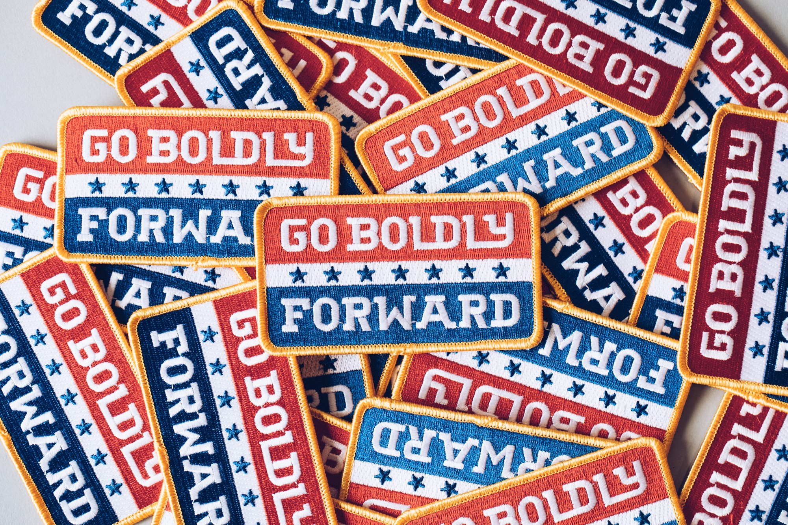

# Values & Purpose

### Personal Purpose 

> _Pioneer a more beatuiful future for others._

In the summer of 2018, I began feeling an increased tension around decision_-_making. Growing up, we are taught to make decisions while weighing ‘right’ and ‘wrong’. As adults, there is more gray area and less objectivity.

My pursuit of a personal purpose statement was an attempt to highlight what matters most and provide a standard against which to weigh key decisions. More than a job description, it’s a declaration of intent. Based on my unique skills, interests, and passions the purpose statement provides a guiding light.

If we are fortunate, we have the opportunity to choose between multiple great options. Without a clear winner, this can lead to indecision or a lack of directed effort.

#### The Result

_Purpose Statement: Pioneer a more beatuiful future for others._

_Mantra: "Show them \[what's possible]"_

_Guiding Questions:_

* Has it been done before?
* Is it challenging?
* Is there asymmetrical risk-reward?
* Who benefits?
* Who loses?

#### Preferred Context

To maximize my opportunity for impact, there are three main areas where my experience and expertise intersect. While the purpose statement provides direction, the well_-_defined context provides an ‘arena’.

* Business
* Technology
* Social Impact

#### The Personal Purpose Framework

A clearly articulated purpose statement helps make decisions and value accomplishments. After months of personal exploration, I’ve created breadcrumbs for others to follow.

[View the Purpose Framework](https://www.morganjlopes.com/purpose-statement-framework)

### Personal Values 

#### Pursue excellence, not perfection. 

Whether in what I do or the way I do it, I care about quality and intentionality. Mistakes happen, but a pursuit of excellence means I learn fast and desire to constantly improve.

#### Create remarkable experiences. 

A remarkable experience for my family, my team members, my friends, and my clients is my priority. It comes down to respect and communication.

#### Be effectively human. 

Though playfully put, being ‘effectively human’ captures the tension of programming cold, rigid machines for living, breathing people. Efficiency and productivity are important but they are not the point. I want to engineer solutions that amplify human experiences.

#### Go boldly forward. 

Courageous, forward movement is key to innovating and doing work that matters. I love to collaborate, pushing myself and others to improve. Wherever possible, I bring others with me.

